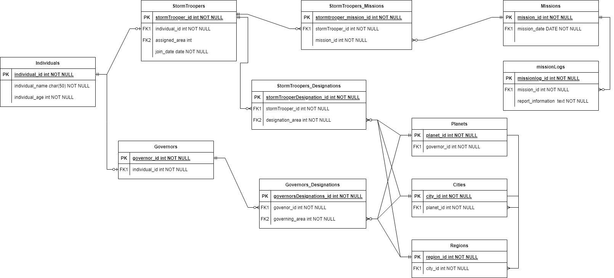

# PriSec Limited Recruitment Exercise

## A. Client-side specific exercise

&ensp;
Please see the [TODO.md](/TODO.md)

&ensp;

## B & C. Programming exercise & System design

&ensp;

### Part 1:

&ensp;
Node CLI application that allows the user to insert and query phone number price quotes. This application ultilizes two [helper functions](./helperFunctions.js).

Dependencies required:

```
npm install jest
```

To run the application:

```
node phoneNumberQuotes.js
```

To test the application:

```
npm run test
```

Application commands:

```javascript
//insert (command can take capitalized or uncapitalize commands)
INSERT [operator] [prefix] [price]

//Query
QUERY [phone number]

```

### Part 2:

&ensp;
ERD for the [Galatic Empire](/2.0-galacticRepublicERD.jpg)

